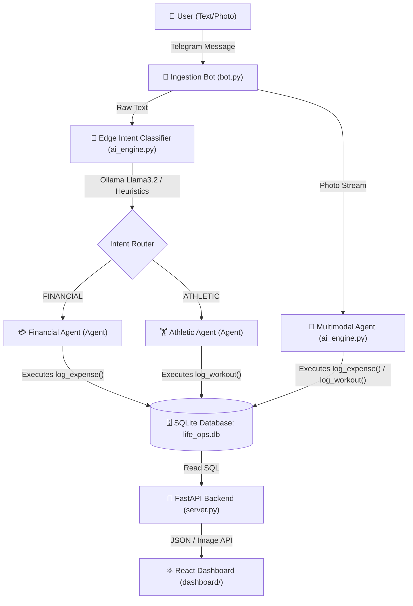

# ⚡ Life Operations Engine

A decentralized, self-correcting personal tracking ledger. It captures unstructured text or photo notes (receipts, workout logs) from your phone via Telegram, classifies the intent or extracts structured details using the **Google Antigravity SDK**, persists them securely in SQLite, and displays your metrics on a premium, high-fidelity **React + Vite** dashboard served by a **FastAPI** backend.

---

## 🏗️ System Architecture



---

## 📁 File Structure

* [db_init.py](file:///Users/sasi/antigravity/life%20ops/db_init.py): Provisions the local SQLite database schema.
* [ai_engine.py](file:///Users/sasi/antigravity/life%20ops/ai_engine.py): Hosts custom tools ([log_expense](file:///Users/sasi/antigravity/life%20ops/ai_engine.py#L18) and [log_workout](file:///Users/sasi/antigravity/life%20ops/ai_engine.py#L37)), image processing, resilience routing heuristics, and the execution pipelines.
* [bot.py](file:///Users/sasi/antigravity/life%20ops/bot.py): Listens for incoming text or photo notes from Telegram and forwards them to the Antigravity SDK.
* [server.py](file:///Users/sasi/antigravity/life%20ops/server.py): The FastAPI backend that queries SQLite and exposes API routes.
* [dashboard/](file:///Users/sasi/antigravity/life%20ops/dashboard): React + TypeScript + Vite + Recharts frontend dashboard.
* [app.py](file:///Users/sasi/antigravity/life%20ops/app.py): Legacy Streamlit dashboard (deprecated).
* [.env.example](file:///Users/sasi/antigravity/life%20ops/.env.example): Reference configuration file for secrets.

---

## ⚙️ Setup Instructions

### 1. Configure the Environment
Create a copy of the template [.env.example](file:///Users/sasi/antigravity/life%20ops/.env.example) and name it `.env` in the root folder:
```ini
TELEGRAM_TOKEN="YOUR_TELEGRAM_BOT_TOKEN"
GEMINI_API_KEY="YOUR_GEMINI_API_KEY"
```

### 2. Verify Dependencies
Install Python packages:
```bash
.venv/bin/pip install -r requirements.txt
```

Install Frontend packages:
```bash
cd dashboard
npm install
```

---

## 🚀 Running the Engine

Open the following terminal windows (ensure virtual environment path `.venv` is used):

### Window 1: Local Edge Classifier
Ensure Ollama is running and has the `llama3.2` model ready:
```bash
ollama run llama3.2
```
*(If Ollama is offline or unavailable, the pipeline automatically fails over to local keyword heuristics and Gemini classification).*

### Window 2: Telegram Bot Listener
```bash
.venv/bin/python bot.py
```

### Window 3: FastAPI Backend API
```bash
.venv/bin/python server.py
```

### Window 4: React Dev Server (Vite)
```bash
cd dashboard
npm run dev
```
Open **`http://localhost:5173`** to access the dashboard with hot-reloading active.

#### Production Build (Single Port Serving)
Alternatively, you can compile the frontend static build and let FastAPI serve it on a single port (`http://localhost:8000`):
```bash
cd dashboard
npm run build
# Then run: .venv/bin/python server.py
```

---

## 📝 Usage Examples

### Financial Intent
* **Text Input:** *"Spent 15.50 SGD on groceries at Fairprice."*
* **Photo Input:** (Send a photo of a dinner receipt from Lau Pa Sat showing a total of 22 SGD.)
* **Result:** Triggers the [log_expense](file:///Users/sasi/antigravity/life%20ops/ai_engine.py#L18) tool, writes transaction to database, and updates the React dashboard "Total Expenses" indicator and "Logged Receipts" grid.

### Athletic Intent
* **Text Input:** *"Heavy workout done. Squats 120kg 3x5, RPE 8. Feeling stiff in the right hip."*
* **Photo Input:** (Send a photo of a gym log or a whiteboard showing "Bench Press 80kg 3x8 RPE 7, right shoulder feeling good".)
* **Result:** Triggers the [log_workout](file:///Users/sasi/antigravity/life%20ops/ai_engine.py#L37) tool, logs training volume, maps `"stiff"` or recovery notes to the fatigue flags array, and updates the Recharts "Volume Trajectory" line chart on the dashboard.
